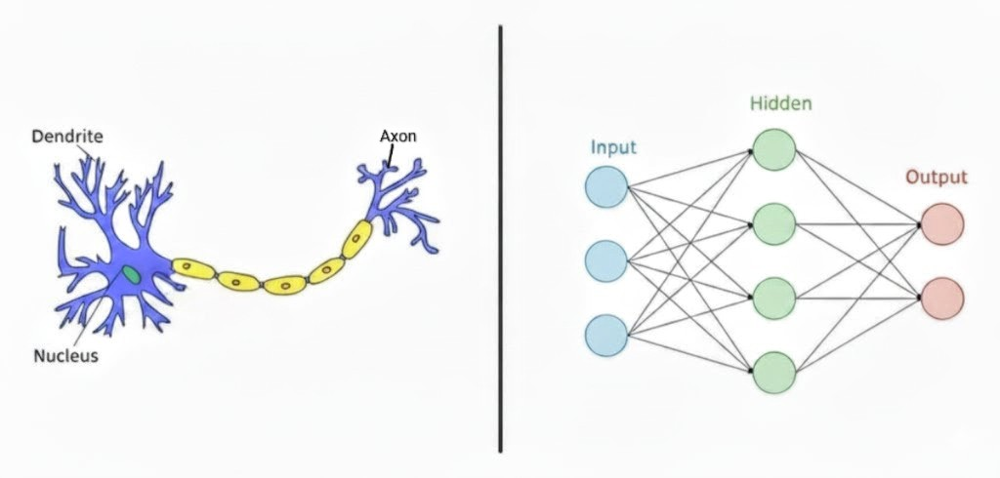
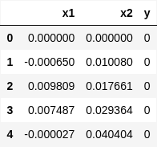
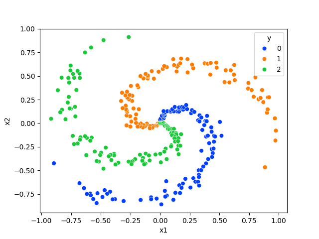
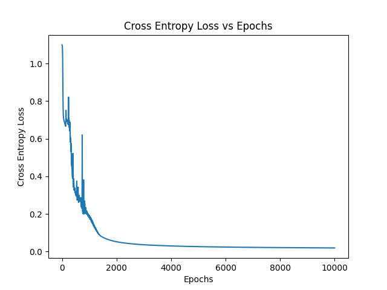
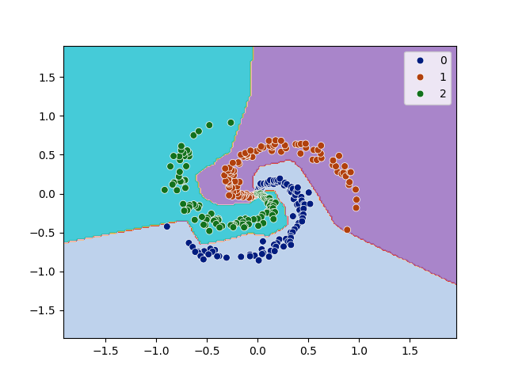

<figure style="margin: auto; text-align: center;">
  
  <figcaption>Fig. 1: Comparison between a human neuron and a artificial neuron</figcaption>
</figure>


Ever felt a little mystified by what's truly churning inside your machine learning model? You call model.fit(), and voilà, it learns! But what's the actual mechanism of "learning"?

Let's strip away the convenience of TensorFlow and PyTorch and build a complete multi-class classifier using only Python and NumPy. This isn't about replacing the big guns; it's about gaining fundamental, rock-solid intuition that will make you a much better deep learning practitioner.

By the end, you'll have a working neural network and, more importantly, the deepest understanding of these four pillars:

* **Forward Propagation**: The prediction path.
* **Loss Calculation**: Measuring the mistake.
* **Backpropagation**: The secret to finding blame.
* **Gradient Descent**: The mechanism of learning.

Let's get started on this adventure!

## 💫 The Spiral Dataset: A Non-Linear Challenge!

To truly see a neural network shine, we need a problem that can't be solved with a simple straight line. Enter the **spiral dataset**.
This dataset consists of three classes of data points arranged in interlocking spirals.
```python
# Download the spiral dataset
import pandas as pd
import matplotlib.pyplot as plt
import numpy as np
import seaborn as sns

!gdown 1dLOPwh01o3k8p_hK633ixhD1ehz6nNWk
df = pd.read_csv("spiral.csv")
df.head()
```
<figure style="width: 80%; max-width: 500px; margin: auto; text-align: center;">
  
  <figcaption>Fig. 2: Dataframe preview</figcaption>
</figure>

```python
# Visualize the spiral data
sns.scatterplot(data=df, x="x1", y="x2", hue="y", s=40, palette="bright")
```
<figure style="width: 80%; max-width: 500px; margin: auto; text-align: center;">
  
  <figcaption>Fig. 3: Spiral</figcaption>
</figure>

## Why this dataset?

1.  **Non-Linearity:** It's impossible to draw straight lines to separate the three colored classes. This immediately rules out simple linear models and forces our network to learn complex, curved decision boundaries.
2.  **Multi-Class:** Unlike a simple yes/no problem, this is a multi-class classification task (class 0, 1, or 2). This allows us to implement a more general-purpose output layer using the Softmax activation function.
3.  **Simplicity:** It's a 2D dataset, making it easy to visualize and understand what our model is learning at each step.

Our data consists of `X`, a matrix where each row is a point with two features (its x and y coordinates), and `y`, a vector containing the corresponding class label for each point.

## 2. Why a Neural Network? The Limits of Simpler Models

A common starting point for classification is **Logistic Regression**. However, for our spiral problem, it would fail spectacularly.

* **Linear Boundaries:** Logistic Regression is a linear classifier. It tries to find the best straight line (or hyperplane in higher dimensions) to separate the data. For our spiral, this is a hopeless task.
* **One-vs-Rest (OvR) for Multi-Class:** To handle three classes, you would need to train *three separate* logistic regression models in a "One-vs-Rest" scheme (Class 0 vs. {1,2}, Class 1 vs. {0,2}, etc.). This is cumbersome.

This is where a Neural Network offers two massive advantages:

1.  **A Single, Unified Model:** A single neural network can handle multi-class classification natively. We simply design an output layer with three neurons—one for each class—and it learns to distinguish between all classes simultaneously.

2.  **Automatic Feature Creation (Non-linearity):** The true magic lies in the hidden layers. By passing data through layers of neurons with **non-linear activation functions** (like ReLU), the network learns to transform the original feature space. It can bend, stretch, and warp the data until the classes become easily separable. In essence, it automatically learns the complex features needed to solve the problem, a task that would require painstaking manual "feature engineering" with simpler models.

## 3. The Underlying Mathematics of a Neural Network

A neural network is, at its heart, a series of nested mathematical functions. Let's break down the process of making a prediction and learning from it.

### Forward Propagation: From Input to Output

This is the process of passing data through the network to get a prediction. For a simple network with one hidden layer:

1.  **Input to Hidden Layer:** We perform a linear transformation of the input data `X` using the first set of weights ($W_1$) and biases ($b_1$).

    $$Z^{[1]} = X \cdot W_1 + b_1$$

2.  **Activation:** We apply a non-linear activation function, like ReLU (Rectified Linear Unit), to introduce non-linearity.

    $$A^{[1]} = \text{ReLU}(Z^{[1]})$$

3.  **Hidden to Output Layer:** We perform a second linear transformation using the second set of weights ($W_2$) and biases ($b_2$).

    $$Z^{[2]} = A^{[1]} \cdot W_2 + b_2$$

4.  **Softmax Activation:** To get probabilities for our three classes, we apply the Softmax function to the final scores ($Z^{[2]}$). Softmax turns a vector of scores into a probability distribution, where all outputs are between 0 and 1 and sum to 1.

    $$\hat{y} = \text{Softmax}(Z^{[2]}) = \frac{e^{Z^{[2]}}}{\sum e^{Z^{[2]}}}$$

The result, $\hat{y}$, is our model's prediction.

### The Loss Function: Measuring Error

Now that we have a prediction, we need to measure how wrong it is. For multi-class classification, we use the **Categorical Cross-Entropy Loss**.

The formula looks intimidating, but the concept is simple: it heavily penalizes the model when it predicts the wrong class with high confidence.

$$L = -\frac{1}{m} \sum_{i=1}^{m} \sum_{k=1}^{K} y_{ik} \log(\hat{y}_{ik})$$

Where:

* $m$ is the number of training examples.
* $K$ is the number of classes (3 in our case).
* $y_{ik}$ is 1 if example $i$ belongs to class $k$, and 0 otherwise.
* $\hat{y}_{ik}$ is the model's predicted probability that example $i$ belongs to class $k$.

Our goal is to adjust the weights and biases to make this loss value as small as possible.

### Backpropagation and Gradient Descent: Learning from Error

This is the core of the learning process.

1.  **Backpropagation:** This is an algorithm that calculates the "gradient" of the loss function with respect to every single weight and bias in the network. A gradient is simply a derivative that tells us two things: the *direction* of steepest ascent of the loss and the *magnitude* of that slope. In short, it tells us how to change each weight/bias to most effectively decrease the loss. It does this by applying the chain rule of calculus, starting from the loss and working its way backward through the network layers.

2.  **Gradient Descent:** Once we have the gradients, we can update our parameters. We take a small step in the *opposite* direction of the gradient, because we want to *decrease* the loss. This update rule is applied to every weight and bias:

    $$\theta_{\text{new}} = \theta_{\text{old}} - \alpha \frac{\partial L}{\partial \theta}$$

    Where:

    * $\theta$ is any parameter (a weight or a bias).
    * $\alpha$ is the **learning rate**, a small hyperparameter that controls the size of our update step.
    * $\frac{\partial L}{\partial \theta}$ is the gradient calculated during backpropagation.

We repeat this cycle of **forward propagation -> calculate loss -> backpropagation -> update parameters** for many iterations (epochs), and with each cycle, our model gets slightly better at classifying the data.

## 4. Code Implementation

Here is where we will translate all the above theory into NumPy code. 
Let's break down what each part of the `NeuralNet` class does.

---

### Initializing our Network
This is where we set up the skeleton of our network.

```python
class NeuralNet:

  def __init__(self, num_featues, num_hidden_neurons, num_classes):
    self.d = num_features
    self.h = num_hidden_neurons
    self.n = num_classes
    # Initialize weight and bias vectors for layer 1
    self.W1 = np.random.randn(self.h, self.d) * 0.01 
    self.b1 = np.zeros((self.h, 1))
    # Initialize weight and bias vectors for layer 2
    self.W2 = np.random.randn(self.n, self.h) * 0.01 
    self.b2 = np.zeros((self.n, 1))
```

-   It takes the number of input **features**, **hidden neurons**, and output **classes** as arguments.
-   It initializes the **weights (`W1`, `W2`)** with small random numbers. This is crucial to break symmetry and ensure different neurons learn different things.
-   It initializes the **biases (`b1`, `b2`)** to zero.
-   `cce_losses` is a list we'll use to track our model's performance over time.

---

### Making a Prediction
This method implements **Forward Propagation**. It takes the input data `X` and passes it through the network to get a prediction.

```python
def forward_pass(self, X):
    Z1 = np.dot(X, self.W1) + self.b1

    # ReLU activation
    A1 = np.maximum(0, Z1)
    Z2 = np.dot(A1, self.W2) + self.b2

    # Softmax activation
    exp = np.exp(Z2)
    A2 = exp/np.sum(exp, axis=1, keepdims=True)

    return A1, A2
```

1.  `Z1 = np.dot(X, self.W1) + self.b1`: Calculates the weighted sum for the hidden layer.
2.  `A1 = np.maximum(0, Z1)`: Applies the **ReLU activation** function. Any negative values in `Z1` are clipped to zero.
3.  `Z2 = np.dot(A1, self.W2) + self.b2`: Calculates the weighted sum for the output layer using the activated outputs from the hidden layer (`A1`).
4.  `A2 = ...`: Applies the **Softmax activation** to the output scores (`Z2`), turning them into class probabilities that sum to 1.
5.  It returns `A1` and `A2`, as we'll need them for the backward pass.


---

### Measuring the Error
```python
def cce_loss(self, A2, y):
    m = y.shape[0]
    log_likelihood = -np.log(A2[range(m),y])
    loss = np.sum(log_likelihood)/m
    return loss
```
This function calculates the **Categorical Cross-Entropy loss**.
-   `m` is the number of training examples.
-   `log_likelihood = -np.log(A2[range(m),y])`: This is a clever NumPy trick. For each example, it finds the predicted probability of the **correct** class (`y`) and calculates its negative logarithm. If the model is confident and correct (probability is close to 1), the loss is low. If it's confident but wrong (probability is close to 0), the loss is very high.
-   `loss = np.sum(log_likelihood)/m`: It averages the loss across all training examples.

---

### The Learning Step
This is the most critical part: **Backpropagation**. Here, we calculate the gradients—the direction and magnitude of change needed for our weights and biases to reduce the loss. We use the chain rule of calculus to work backward from the loss.

```python
def backward_pass(self, X, y, A1, A2):
    m = y.shape[0]

    #back prop into W2 and b2
    dZ2 = A2.copy()
    dZ2[range(m),y] -= 1
    dZ2 /= m
    dW2 = np.dot(A1.T, dZ2)
    db2 = np.sum(dZ2, axis=0, keepdims=True)

    # back prop into hidden layer
    dA1 = np.dot(dZ2, self.W2.T)
    dZ1 = dA1.copy()
    dZ1[A1 <= 0] = 0
    dW1 = np.dot(X.T, dZ1)
    db1 = np.sum(dZ1, axis=0, keepdims=True)

    return dW1, dW2, db1, db2
```

**1. Gradient for the Output Layer (`dZ2`)**

The gradient of the CCE loss with respect to the pre-activation output `Z2` has a beautiful simplification: it's just the predicted probabilities minus the true labels (in one-hot format).

-   `dZ2 = A2.copy()`: Start with the predicted probabilities.
-   `dZ2[range(m),y] -= 1`: For each example, subtract 1 from the column corresponding to the correct class. This efficiently computes `(Predicted - True)` without creating a full one-hot matrix.
-   `dZ2 /= m`: We average the gradient across the batch.
-   **Math:** $\frac{\partial L}{\partial Z_2} = A_2 - Y_{\text{one-hot}}$

**2. Gradients for `W2` and `b2`**

Now we use `dZ2` to find the gradients for the second layer's weights and bias.

-   `dW2 = np.dot(A1.T, dZ2)`: This calculates the gradient for `W2`. The error contribution of `W2` depends on the output error (`dZ2`) and the activation that fed into it (`A1`).
-   `db2 = np.sum(dZ2, axis=0, keepdims=True)`: The gradient for `b2` is simply the sum of the output layer's error.
-   **Math:** $\frac{\partial L}{\partial W_2} = A_1^T \cdot \frac{\partial L}{\partial Z_2}$ and $\frac{\partial L}{\partial b_2} = \sum \frac{\partial L}{\partial Z_2}$

**3. Gradients for the Hidden Layer (`dZ1`)**

Next, we propagate the error further back to the hidden layer.

-   `dA1 = np.dot(dZ2, self.W2.T)`: First, we calculate the error with respect to the hidden layer's *activation* `A1`.
-   `dZ1 = dA1.copy()` followed by `dZ1[A1 <= 0] = 0`: This calculates the error with respect to the hidden layer's *pre-activation* `Z1`. This step applies the derivative of the **ReLU** function. The derivative is 1 for positive values and 0 for negative values, so we "kill" the gradient for any neuron that was inactive (`<= 0`) during the forward pass.
-   **Math:** $\frac{\partial L}{\partial Z_1} = \frac{\partial L}{\partial A_1} \cdot \frac{\partial A_1}{\partial Z_1} = (\frac{\partial L}{\partial Z_2} \cdot W_2^T) \cdot \text{ReLU}'(Z_1)$

**4. Gradients for `W1` and `b1`**

Finally, we calculate the gradients for the first layer's weights and bias using `dZ1`.

-   `dW1 = np.dot(X.T, dZ1)`: The gradient for `W1` depends on the hidden layer's error (`dZ1`) and the original input `X`.
-   `db1 = np.sum(dZ1, axis=0, keepdims=True)`: The gradient for `b1` is the sum of the hidden layer's error.
-   **Math:** $\frac{\partial L}{\partial W_1} = X^T \cdot \frac{\partial L}{\partial Z_1}$ and $\frac{\partial L}{\partial b_1} = \sum \frac{\partial L}{\partial Z_1}$

---

### The Training Loop
This method orchestrates the entire training process.

```python
def fit(self, X, y, epochs=1000, learning_rate=0.01):
    epoch_part_10 = epochs//10
    for i in range(epochs):
      A1, A2 = self.forward_pass(X)
      loss = self.cce_loss(A2, y)
      if i % epoch_part_10 == 0 or i == epochs:
        print("iteration %d: loss %f" % (i, loss))
      self.cce_losses.append(loss)

      dW1, dW2, db1, db2 = self.backward_pass(X, y, A1, A2)

      self.W1 -= learning_rate * dW1
      self.b1 -= learning_rate * db1
      self.W2 -= learning_rate * dW2
      self.b2 -= learning_rate * db2
```

-   It loops for a specified number of `epochs`.
-   In each loop, it performs a `forward_pass` and `backward_pass`.
-   It then updates the network's parameters using the **gradient descent** update rule: `parameter = parameter - learning_rate * gradient`.
-   It also prints the loss periodically so we can monitor the training progress.

---

### Using the Trained Model

```python
def predict(self, X):
    _, A2 = self.forward_pass(X)
    y_hat = np.argmax(A2, axis=1)
    return y_hat
```

Once the model is trained, this simple method takes new, unseen data `X`, performs a forward pass, and returns the class with the highest probability for each input using `np.argmax`.

### Now finally executing our model

This code block brings everything together to prepare the data, train the network, and evaluate its performance.

```python
X = df.drop('y', axis=1).values
y = df['y'].values
nn_model = NeuralNet(num_features=2, num_hidden_neurons=100, num_classes=3)
nn_model.fit(X, y, learning_rate=1, epochs=10000)
```

```
iteration 0: loss 1.098386
...
iteration 9000: loss 0.020325
training accuracy: 0.99 %
```
* **Learning Progress**: The printed output shows the loss at different iterations. The fact that the loss steadily decreases from 1.098 to 0.020 is a clear sign that our network is successfully learning the patterns in the data.

* **Final Accuracy**: The last line calculates the model's accuracy on the training data. The result of 99% confirms that our neural network, built entirely from scratch, has successfully learned the complex, non-linear decision boundaries required to classify the spiral dataset. 

### Plotting the Loss Curve
This snippet visualizes the model's learning progress over time.
```python
plt.plot(nn_model.cce_losses)
plt.xlabel("Epochs")
plt.ylabel("Cross Entropy Loss")
plt.title("Cross Entropy Loss vs Epochs")
plt.show()
```
<figure style="margin: auto; text-align: center;">
  
  <figcaption>Fig. 4: The Loss Curve </figcaption>
</figure>

* `plt.plot(nn_model.cce_losses)` takes the list of loss values that we saved during training and plots them.

* The resulting graph is a powerful diagnostic tool. A steady downward slope, as seen in this type of plot, is excellent visual confirmation that the model is successfully learning and minimizing its error with each epoch.

### Visualizing the Decision Boundary
This snippet creates a visualization to show exactly what non-linear boundaries our model has learned. 

```python
# Create a grid of points
step = 0.02
x_min, x_max = X[:, 0].min() - 1, X[:, 0].max() + 1
y_min, y_max = X[:, 1].min() - 1, X[:, 1].max() + 1
xx, yy = np.meshgrid(np.arange(x_min, x_max, step), np.arange(y_min, y_max, step))

# Predict the class for each point in the grid
y_hat = nn_model.predict(np.c_[xx.ravel(), yy.ravel()])
y_hat = y_hat.reshape(xx.shape)

# Plot the colored regions and the original data
plt.contourf(xx, yy, y_hat, cmap=plt.cm.tab20, alpha=0.8)
sns.scatterplot(x=X[:, 0], y=X[:, 1], hue=y, s=40, palette="dark")
plt.show()
```

<figure style="margin: auto; text-align: center;">
  
  <figcaption>Fig. 5: Decision boundary over our spiral dataset</figcaption>
</figure>

This code generates a "decision boundary" plot, which is one of the best ways to understand what a classifier is doing.

* Create a Grid: First, it creates a fine grid of points that covers the entire area of the plot.

* Predict on Grid: It then uses our trained nn_model to predict the class (0, 1, or 2) for every single point on this grid.

* Plot Regions: The plt.contourf function creates a filled contour plot, assigning a color to each region of the grid based on the model's prediction.

The final visualization shows the beautiful, non-linear, spiral-shaped boundaries that our network has learned to perfectly separate the three classes. This is the ultimate proof that our from-scratch model works!

## 5. Key Takeaways and Endnote

Congratulations! Going through the process of building a neural network from scratch is a huge step toward mastering deep learning. Even if you go back to using high-level frameworks for your day-to-day work, you now have a powerful mental model of what's happening under the hood.

**The core takeaways are:**

* **The Flow:** Neural networks learn through a cycle: a **forward pass** to make a prediction, a **loss function** to quantify error, **backpropagation** to find out which parameters are responsible for the error, and **gradient descent** to update those parameters.
* **Non-linearity is Key:** Activation functions are not an afterthought; they are the essential ingredient that allows networks to learn complex, non-linear patterns that are inaccessible to linear models.
* **Math is the Foundation:** At the end of the day, a neural network is a differentiable function that is optimized through calculus. Understanding the roles of the dot product, activation functions, and derivatives demystifies the entire process.

This foundation will serve you well as you explore more advanced architectures like CNNs and RNNs. You now know that no matter how complex the model, the fundamental principles of forward propagation, backpropagation, and optimization remain the same. Keep experimenting, and happy coding! 🚀✨