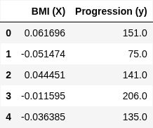
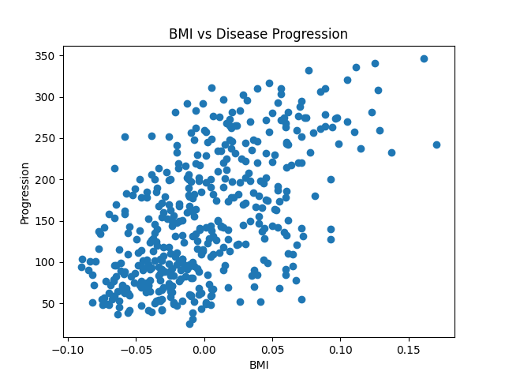
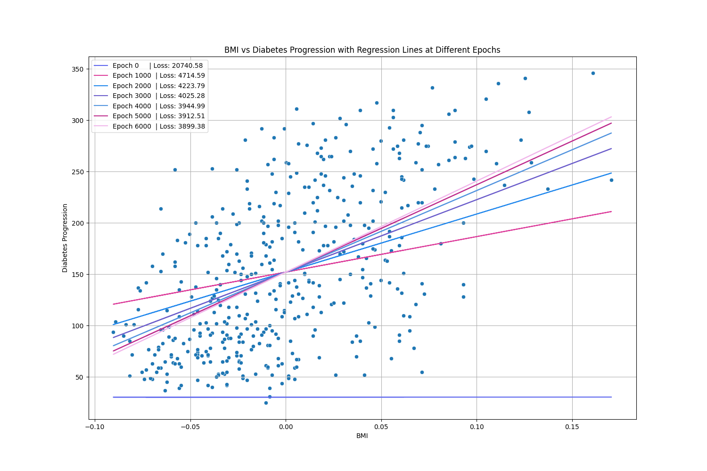

Ever wondered what's really going on inside a machine learning model? This post is for you! 🧐 It’s time to ditch the fancy libraries like Scikit-learn and build a simple linear regression model completely from scratch. This guide gets us to roll up our sleeves and dive into the core concepts—like the cost function and the awesome Gradient Descent algorithm—to see how a model *actually* learns from data. By the end, you'll have a much deeper understanding of the magic behind the curtain and will have coded your very own predictive model. 🚀

## About the Dataset: BMI vs. Disease Progression

For this project, we'll be using the classic diabetes dataset from the scikit-learn library. This dataset contains data from 442 diabetes patients, with ten baseline variables like age, sex, body mass index (BMI), and blood pressure. The goal is to predict disease progression one year after the initial measurements.

For this tutorial, we will focus on the relationship between **BMI** and **disease progression**. It’s a straightforward, two-column problem perfect for understanding the core mechanics of linear regression.

### Why this dataset?

The goal here is to learn how to **build** a linear regression model, not how to clean and analyze a complex dataset. We're using this specific one because:

* **It's Simple:** With just one input feature (BMI) and one output (disease progression), we can focus entirely on the algorithm's code without getting distracted by complex data manipulation.
* **It's Intuitive:** There's a clear, positive linear relationship. As BMI increases, the disease progression tends to increase. This makes it easy to visualize and check if our model is learning correctly.
* **It's a Real-World Dataset:** While we are simplifying it for this tutorial, it's a real-world dataset, which gives you a taste of what it's like to work with actual health data.

### A Note on Skipping EDA

In a real-world project, **Exploratory Data Analysis (EDA)** is a crucial first step. You would normally spend significant time visualizing data, checking for missing values, and understanding feature distributions.

However, for this tutorial, we're making a deliberate exception and **skipping a deep EDA phase**. Since our primary objective is to understand the math and code behind Gradient Descent and the regression algorithm itself, we've chosen a "textbook-perfect" relationship from the dataset where the path forward is clear. This lets us jump straight into the fun part: building the model!

You can easily load this dataset using the `sklearn.datasets.load_diabetes` function. For more details, see the official documentation.
**Documentation:** [Scikit-learn Diabetes Dataset](https://scikit-learn.org/stable/datasets/toy_dataset.html#diabetes-dataset)

## The Theory: How to Teach a Computer to Draw a Line

Alright, we've got the data. If you were to plot it, you’d see a cloud of dots. Our goal is to teach the computer how to draw a single straight line that slices right through the middle of that cloud, representing the data as accurately as possible.

This "line of best fit" is our actual **model**. But how do we find it? It all boils down to three core ideas.

### 1. The Hypothesis: Just a Fancy Name for a Line

Remember this from school?

> $$
> y = mx + c
> $$

This is the equation for a straight line. In our case, `y` is the **Disease Progression**, and `x` is the **BMI**.

> $$
> \text{Disease Progression} = (w \cdot \text{BMI}) + c
> $$

In machine learning, **m** (the slope) is called the **weight** ($w$), and **c** (the y-intercept) is called the **bias**. These two values, $w$ and $c$, are the only things we need to define our line. Think of them as tuning knobs. Our mission is to find the *perfect* values for these knobs so the line fits our data snugly. This equation is our **hypothesis**—it's our best guess about the relationship between BMI and Disease Progression.

### 2. The Cost Function: Scoring How "Wrong" We Are

So, we start by picking random values for $w$ and $c$. The line will probably look terrible. How do we measure *how* terrible it is? We need a score.

For every single data point, we can measure the vertical distance between that point and our line. This distance is the **error**. To get a total score, we can't just add up the errors (they'd cancel each other out). So, we **square** each error and then calculate the average.

This score is called the **Mean Squared Error (MSE)**, and it’s our **cost function**. Its job is simple: to tell us, with a single number, how bad our $w$ and $c$ values are.

**The goal is to get this MSE score as low as possible.**

### 3. The Mechanics of Learning: From Foggy Hillsides to Mathematical Gradients

So, our model has a loss function (like MSE) that tells it how wrong it is. But how does it actually *learn* the best parameters—the weight ($w$) and bias ($b$)—to minimize this error? It uses a brilliant and fundamental algorithm called **Gradient Descent**.

Imagine you're standing on a foggy hillside, and your goal is to get to the lowest point in the valley. You can't see the bottom, but you can feel the slope of the ground right where you're standing. The most logical thing to do is to take a step in the steepest *downhill* direction. You repeat this process: check the slope, take a careful step, check the slope again, and take another step. Eventually, you'll arrive at the bottom of the valley.

That's exactly what Gradient Descent does!

* **The Valley** is our Loss Function (MSE). The lower you are, the smaller the error.
* **Your Position** represents the current values of your parameters, $w$ and $b$.
* **The Direction Downhill** is the **gradient** of the loss function. A bit of calculus tells the algorithm the steepest direction to move in to reduce the error.
* **The Size of Your Step** is the **learning rate ($\eta$)**. This is a small number you set. If it's too big, you might step right over the bottom of the valley! If it's too small, it will take forever to get there.

This intuitive process has a precise mathematical foundation. Let's break down the core components and the calculus that powers it.

### The Mathematical Toolkit

For our explanation, let's use our simple linear regression model. Its prediction for a single data point ($x_i$) is given by:

$$ \hat{y}_i = w x_i + b $$

To train this model, we need four key components:

1.  **Parameters:** The values the model learns: the **weight ($w$)** and the **bias ($b$)**.
2.  **Loss Function ($L$):** Our measure of total error. We'll continue with **Mean Squared Error (MSE)**.
    $$L = \frac{1}{n} \sum_{i=1}^{n} (y_i - \hat{y}_i)^2 = \frac{1}{n} \sum_{i=1}^{n} (y_i - (wx_i + b))^2$$
3.  **Learning Rate ($\eta$):** A small positive number (e.g., 0.01) that controls the size of our "step" during each update.
4.  **Gradient:** The derivative of the loss function. It tells us the direction of steepest *ascent* (uphill).

### The General Update Rule

Since the gradient points uphill, we move in the **opposite** direction to descend into the valley. For each training iteration, we update every parameter in the model using this simple rule:

> New Parameter = Old Parameter - (Learning Rate × Gradient of the Parameter)

Mathematically, this looks like:
* **Weight Update:** $w_{new} = w_{old} - \eta \frac{\partial L}{\partial w}$
* **Bias Update:** $b_{new} = b_{old} - \eta \frac{\partial L}{\partial b}$

The magic is in calculating the gradient terms: $\frac{\partial L}{\partial w}$ and $\frac{\partial L}{\partial b}$. These are the partial derivatives that tell us the "slope" of the loss function with respect to each parameter.

### Calculating the "Steepest Downhill" Direction

Let's calculate these gradients for our MSE loss function using the chain rule from calculus.

#### 1. Gradient of Loss with respect to Weight ($w$)

We need to find how the loss $L$ changes as we change the weight $w$.

$$ \frac{\partial L}{\partial w} = \frac{\partial}{\partial w} \left[ \frac{1}{n} \sum_{i=1}^{n} (y_i - (wx_i + b))^2 \right] $$

Applying the chain rule:
$$ \frac{\partial L}{\partial w} = \frac{1}{n} \sum_{i=1}^{n} 2(y_i - (wx_i + b)) \cdot \frac{\partial}{\partial w}(y_i - wx_i - b) $$
$$ \frac{\partial L}{\partial w} = \frac{1}{n} \sum_{i=1}^{n} 2(y_i - \hat{y}_i) \cdot (-x_i) $$

This gives us the final gradient for the weight:
$$ \frac{\partial L}{\partial w} = -\frac{2}{n} \sum_{i=1}^{n} x_i (y_i - \hat{y}_i) $$

#### 2. Gradient of Loss with respect to Bias ($b$)

Similarly, we find how the loss $L$ changes as we change the bias $b$.

$$ \frac{\partial L}{\partial b} = \frac{\partial}{\partial b} \left[ \frac{1}{n} \sum_{i=1}^{n} (y_i - (wx_i + b))^2 \right] $$

Applying the chain rule:
$$ \frac{\partial L}{\partial b} = \frac{1}{n} \sum_{i=1}^{n} 2(y_i - (wx_i + b)) \cdot \frac{\partial}{\partial b}(y_i - wx_i - b) $$
$$ \frac{\partial L}{\partial b} = \frac{1}{n} \sum_{i=1}^{n} 2(y_i - \hat{y}_i) \cdot (-1) $$

This gives us the final gradient for the bias:
$$ \frac{\partial L}{\partial b} = -\frac{2}{n} \sum_{i=1}^{n} (y_i - \hat{y}_i) $$

### The Learning Loop in Action

Now we can substitute these specific gradients back into our general update rules:

* **Weight Update:** $w_{new} = w_{old} - \eta \left( -\frac{2}{n} \sum_{i=1}^{n} x_i (y_i - \hat{y}_i) \right)$
* **Bias Update:** $b_{new} = b_{old} - \eta \left( -\frac{2}{n} \sum_{i=1}^{n} (y_i - \hat{y}_i) \right)$

This is the core of how the model learns. In each step, the algorithm calculates the error $(y_i - \hat{y}_i)$ for all data points, computes the gradients, and nudges the weights and bias in the exact direction that will make the total error smaller. This process is repeated thousands of times until the loss is minimized and the model's predictions are as accurate as possible—finally reaching the bottom of the valley.

## Let's Get Coding!

Time to translate the theory into Python.

### Step 1: Import Libraries and Load Data

First things first, let's import the necessary libraries—`numpy` for the math, `pandas` to load our data, and `matplotlib` to see what's going on. Then, load the dataset into a pandas DataFrame.
```python
import matplotlib.pyplot as plt
import pandas as pd
import numpy as np
import warnings
import random
from sklearn.datasets import load_diabetes

warnings.filterwarnings('ignore')
```
```python
# Load the dataset
diabetes_data = load_diabetes()
X_bmi = diabetes_data.data[:, np.newaxis, 2]

# Create a DataFrame for easier viewing
X = pd.DataFrame(X_bmi, columns=['BMI'])
y = pd.Series(diabetes_data.target, name='progression')
```
<figure style="width: 80%; max-width: 500px; margin: auto; text-align: center;">
  
  <figcaption>Fig. 1: Dataframe preview</figcaption>
</figure>

### Step 2: Prepare and Visualize the Data
Next, we'll use or extracted X and Y values from the DataFrame to plot the raw data as a scatter plot 


```python
plt.scatter(X, y)
plt.xlabel('BMI')
plt.ylabel('Progression')
plt.title('BMI vs Disease Progression')
plt.show()
```

<figure style="width: 80%; max-width: 500px; margin: auto; text-align: center;">
  
  <figcaption>Fig. 2: BMI vs Disease Progression plot</figcaption>
</figure>

### 3. Building the Model: A Step-by-Step Code Implementation

Now, let's translate our `LinearRegression` class into Python code. We'll walk through each method, explaining how it connects back to the theory we've just covered.

First, we define our class, `LinearRegression`. All the logic for our model will live inside this class.
```python
class LinearRegression() 
```

### 1. The `__init__` Method: Initializing the Model

Every class needs an initializer. This method sets up the model's hyperparameters and prepares its internal state.
```python
def __init__(self, learning_rate=0.01, iterations=5):
    self.learning_rate = learning_rate
    self.iterations = iterations
    self.error_list=[]
    self.weight_list = []
    self.bias_list = []
    self.W = None
    self.b = None
```
**Explanation:**

* `__init__` is called whenever we create a new instance of our model (e.g., `model = LinearRegression()`).
* `learning_rate` ($\eta$): This is the "step size" for our Gradient Descent algorithm. We give it a default value of `0.01`.
* `iterations`: This is the number of times we will run our training loop. More iterations mean more steps taken towards the minimum of the cost function.
* `error_list`, `weight_list`, `bias_list`: We create these empty lists to track how our model's error, weight, and bias change during training. This is incredibly useful for visualizing the learning process later on.
* `self.W` and `self.b`: We initialize the weight and bias to `None`. They have no value yet because the model hasn't been trained. They will get their initial values inside the `fit` method.


### 2. The `fit` Method: The Training Engine

This is the most important method. It takes the training data (`X` and `Y`) and runs the entire Gradient Descent process.
```python
def fit(self, X, Y):
    # no_of_training_examples, no_of_features
    self.m, self.d = X.shape
    # weight initialization
    self.W = np.zeros(self.d)
    self.b = 0
    self.X = X
    self.Y = Y
    # gradient descent learning
    for i in range(self.iterations):
      self.update_weights()
      Y_pred=X.dot(self.W)+self.b
      if i%1000 == 0:
        error=np.square(np.subtract(Y,Y_pred)).mean()
        self.error_list.append(error)
        self.weight_list.append(self.W)
        self.bias_list.append(self.b)
    return self
```
**Explanation:**

1.  **Get Dimensions:** We get the number of data points (`m`) and the number of input features (`d`) from the shape of our input data `X`.
2.  **Initialize Parameters:** We set the starting point for our "walk down the foggy hillside." The weights `self.W` are initialized to a numpy array of zeros, and the bias `self.b` is set to `0`.
3.  **Store Data:** We store `X` and `Y` as instance variables so they can be easily accessed by other methods like `update_weights`.
4.  **The Learning Loop:** The `for` loop runs for the specified number of `iterations`. In each iteration, it performs one step of Gradient Descent by calling `self.update_weights()`.
5.  **Logging Progress:** Every 1000 iterations, we calculate the Mean Squared Error (MSE) and store it, along with the current weight and bias. This gives us snapshots of the learning process.


### 3. The `update_weights` Method: Taking a Step

This method implements the core mathematical step of Gradient Descent. It calculates the gradients and updates the parameters accordingly.
```python
def update_weights(self):
    Y_pred = self.predict( self.X )
    # calculate gradients
    dW = - (2*(self.X.T ).dot(self.Y - Y_pred))/self.m
    db = - 2*np.sum(self.Y - Y_pred)/self.m
    # update weights
    self.W = self.W - self.learning_rate * dW
    self.b = self.b - self.learning_rate * db
    return self
```
**Explanation:**

This is the math from our theory section, translated into code!

1.  **Get Predictions:** First, we calculate the model's current predictions (`Y_pred`) with the existing `W` and `b`.
2.  **Calculate Gradients:**
    * `dW`: This line calculates the gradient of the cost function with respect to the weight `W`. It's the vectorized version of the formula: $\frac{\partial L}{\partial w} = -\frac{2}{n} \sum x_i (y_i - \hat{y}_i)$. `(self.X.T).dot(self.Y - Y_pred)` is a fast, `numpy`-powered way to perform the sum of `x * error`.
    * `db`: This calculates the gradient with respect to the bias `b`, which is the vectorized version of: $\frac{\partial L}{\partial b} = -\frac{2}{n} \sum (y_i - \hat{y}_i)$.
3.  **Update Parameters:** We apply the update rule: `New Parameter = Old Parameter - (Learning Rate × Gradient)`. This nudges `self.W` and `self.b` in the direction that minimizes the error, effectively taking one step downhill.


### 4. The `predict` Method: Making a Guess

Once the model is trained, we need a way to use it. The `predict` method takes new data and uses the learned parameters to make a prediction.
```python
def predict(self, X):
    return np.dot(X, self.W)+self.b
```
**Explanation:**

* This is our hypothesis function: $\hat{y} = wx + b$.
* `X.dot(self.W)` is the `numpy` way of calculating the dot product between the input features `X` and the learned weights `W`. This is mathematically equivalent to $(w \cdot x)$ for all data points at once. We then add the bias `b`.


## Putting It All Together: Training, Visualization, and Final Thoughts

We have built the theory and the code; now let's see our model in action. The final step is to train our `LinearRegression` class on the diabetes dataset and visualize the results to truly understand the learning process.

### Training and Visualizing the Model

The following code block will instantiate our model, train it using the `.fit()` method, and then generate a plot to show how the model's regression line improves over time.

```python
# --- 1. Training the Model ---
lr = LinearRegression(learning_rate=0.1, iterations=7000)
lr.fit(X, y)

# --- 2. Visualizing the Learning Process ---
plt.figure(figsize=(10, 7))
sns.scatterplot(x=X.squeeze(), y=y)

# Generate and plot regression lines from our training history
legend_labels = []
for i in range(len(lr.error_list)):
  temp_pred = lr.weight_list[i]*X + lr.bias_list[i]
  random_color = "#" + ''.join([random.choice('0123456789ABCDEF') for j in range(6)])
  plt.plot(X, temp_pred, color=random_color)
  legend_labels.append(f'Epoch {i*1000:<5} | Loss: {lr.error_list[i]:.2f}')

# --- 3. Formatting the Plot ---
plt.xlabel('BMI')
plt.ylabel('Diabetes Progression')
plt.title('BMI vs Diabetes Progression with Regression Lines at Different Epochs')
plt.legend(handles=plt.gca().get_lines()[1:],
           labels=legend_labels,
           bbox_to_anchor=(1.05, 1), loc='upper left', fancybox=True, title="Training Progress")
plt.grid(True)
plt.show()
```

<figure style="margin: auto; text-align: center;">
  
  <figcaption>Fig. 3: Plot showing regression lines at different epochs</figcaption>
</figure>

This visualization is a powerful illustration of Gradient Descent. The legend clearly shows how the model's error (Loss) decreases as the line progressively moves to find the best possible fit.

# For Comparison: The Scikit-learn Way
In a real-world project, you would use a highly optimized library like scikit-learn. The same task can be accomplished in just a few lines:

```python
from sklearn.linear_model import LinearRegression
```
## 1. Create and train the model
```python
sklearn_model = LinearRegression()
sklearn_model.fit(X, y)
```
## 2. Check the results
```python
print(f"Scikit-learn weight: {sklearn_model.coef_[0]:.4f}")
print(f"Scikit-learn bias: {sklearn_model.intercept_:.4f}")
```
Building our model from scratch was about understanding the mechanics behind the `.fit()` method. Scikit-learn provides a fast and reliable tool, but now you know the fundamental principles of how it works.

# Key Takeaways
* **Linear Regression** finds the best-fitting straight line ($y = wx + b$) to describe the relationship between variables.

* The "best fit" is found by minimizing a **Cost Function**, like Mean Squared Error (MSE), which measures the model's total error.

* **Gradient Descent** is the optimization algorithm that iteratively adjusts the weight (w) and bias (b) to minimize this cost, effectively "learning" from the data.

* **The Learning Rate** is a critical hyperparameter that controls the step size of Gradient Descent.

* Building a model from scratch demystifies machine learning, connecting the underlying math to practical code.

## End Note
And there you have it! You've officially built a linear regression model from scratch. Give yourself a pat on the back—you've turned complex math into simple, working code. The next time you use a library and type `.fit()`, you'll know the magic happening under the hood.

This is a huge step in your machine learning journey. The best way to learn is by doing, so keep experimenting with this code, try it on new data, and see what you can build next.

Keep up the great work, and happy coding! 🚀✨